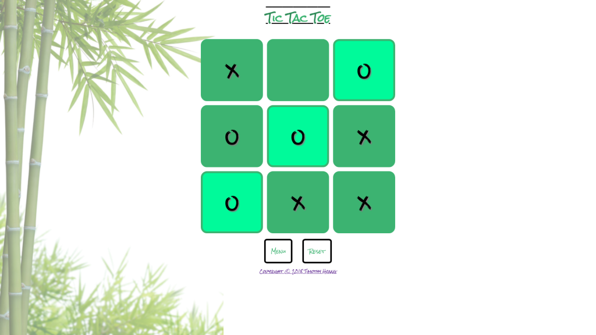
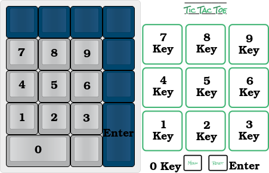
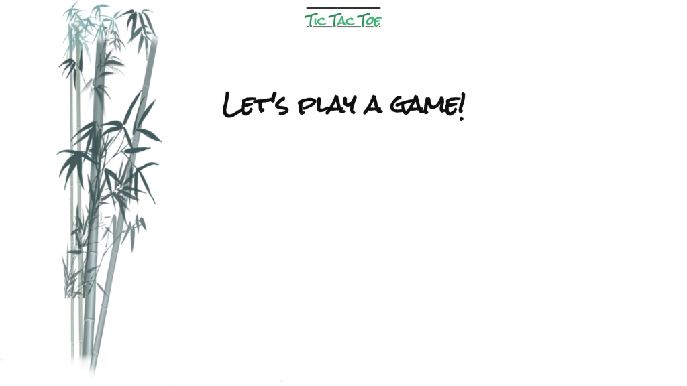
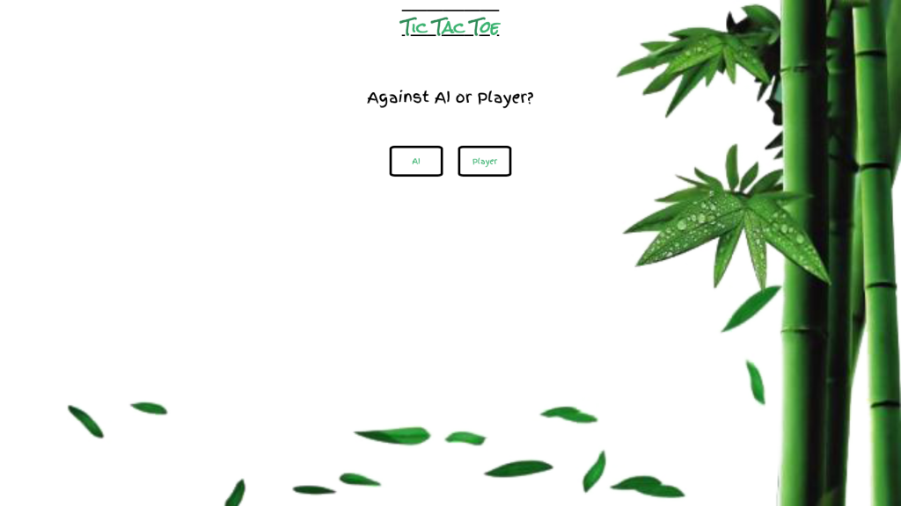
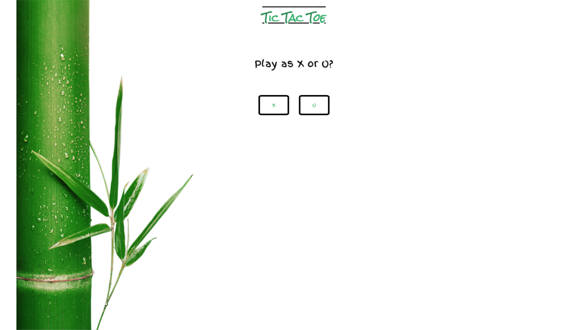
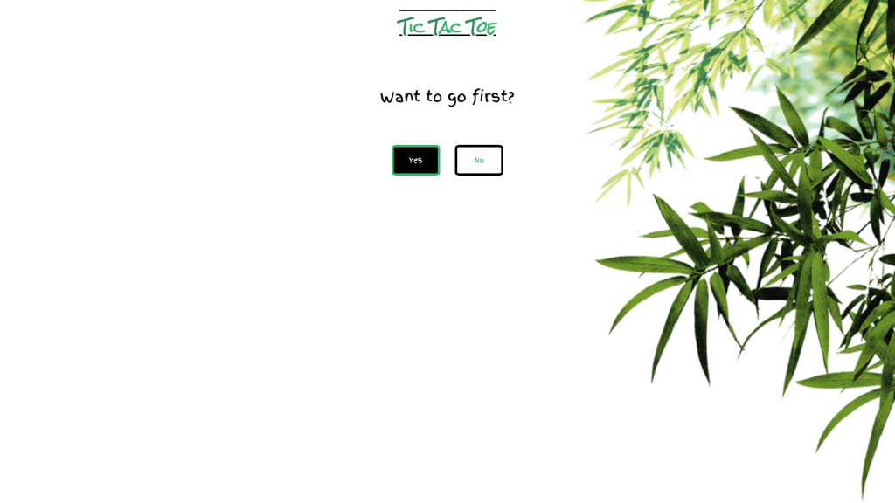

# Tic Tac Toe Game by Timothy Hoang

<figure></figure>

## To view this app online
- To view deployed app, visit: https://timh1203.github.io/tictactoe-game

## To edit the source code
- Github Repo: https://github.com/timh1203/tictactoe-game
1. Have NPM and NodeJS installed on your computer
2. Navigate to the directory of choice and type `git clone https://github.com/timh1203/tictactoe-game`
3. Alternatively, you can also fork the repo and clone it (no future updates planned)
4. Open up your favorite editor and have fun!

## About
- [Tic Tac Toe](https://en.wikipedia.org/wiki/Tic-tac-toe) is a game that has been traced back to ancient Egypt
- It's also known as Noughts and Crosses
- This app is meant to have enjoyed either with other players or with the AI
- This app is designed for anyone and can be used by everyone
- Currently: final stage, no more future updates planned (as of 3/5/2018)

## Features
- Play this old-school game with a fun bamboo theme
- Option to play against AI (miniMax algorithm) or another player
- Option to play as "X" or "O"
- Option to take the first turn
- Ability to return to the main menu to change options
- Ability to reset the game board at any point
- Key mappings of number pad to play the game with keyboard
- Highlight of winning squares and all squares when game has ended

## Minor Features
<figure></figure>

- Number pad `1` key for bottom left square
- Number pad `2` key for bottom middle square
- Number pad `3` key for bottom right square
- Number pad `4` key for center left square
- Number pad `5` key for center middle square
- Number pad `6` key for center right square
- Number pad `7` key for top left square
- Number pad `8` key for top middle square
- Number pad `9` key for top right square
- Number pad `0` key to return to main menu
- Number pad `Enter` key to return to reset the current game

## App flow
1. The game starts with a small introduction screen
2. Select the options that you would like to play the game:
- Play against AI or player?
- Play as X or O?
- Take the first turn?
3. Start the game and try to score three in a row
- You can use the number pad using the keys listed under "Minor Features" to play
4. Click reset if you want to start a new game with the same settings
5. Click menu if you want to change the game settings

## What is the MiniMax Algorithm?
- The MiniMax algorithm is a recursive algorithm which the AI assesses all the possible outcomes and assigns a score based on the terminal state. The role of the maximizer is to score the highest positive amount of points as the minimizer trying to score the most negative amount of points. This maximizer-minimizer role exists solely in the algorithm and not to the game as a whole.

- In this algorithm, the computer plays the role of the maximizer and the human is the minimizer. When it is the computer's turn, the algorithm will find all the empty squares and loop through all the spaces. The computer will place a marker in the first empty space, then alternate with the player's marker to the next empty space, then alternates back to the computer, and so on. This meta process occurs until it reaches a terminal state. 

- Upon reaching the terminal state and it is a win for the computer, the score will return a positive 10. If it's loss for the computer, it will return a negative 10. If that iteration does not have a terminal state, the algorithm will continue running deeper until it reaches that state. The score then passes up to the original first square that the computer marked. Subsequently, each square now has a score that the computer can evaluate to calculate the best move. In a sense, the computer can calculate and see all the possibilities of the end of the game and can pick the best path to win. It evaluates all these possibilities on every turn and follow destiny to either a win or a minimum, a draw state. This is the beauty of the MiniMax Algorithm.

- There are a ton of youtube videos, articles, and repositories of some incredible renditions of this projects so stop by your local search line on Google to find more 
- Some recommended resources are:
1. Jason Fox's article @ [Tic Tac Toe: Understanding the Minimax Algorithm](https://www.neverstopbuilding.com/blog/2013/12/13/tic-tac-toe-understanding-the-minimax-algorithm13/)
2. Ahmad Abdolsaheb's article @ [How to make your Tic Tac Toe game unbeatable by using the minimax algorithm](https://medium.freecodecamp.org/how-to-make-your-tic-tac-toe-game-unbeatable-by-using-the-minimax-algorithm-9d690bad4b37)
3. ReactJS official docs at [reactjs.org](https://reactjs.org/tutorial/tutorial.html)

## Technologies for this project
- HTML
- CSS
- JavaScript
- ReactJS (Create-React-App)
- Images provided by [PNG Tree](https://pngtree.com/)

## More pictures
### Intro Screen
<figure></figure>

### Players Screen
<figure></figure>

### Markers Screen
<figure></figure>

### Turns Screen
<figure></figure>